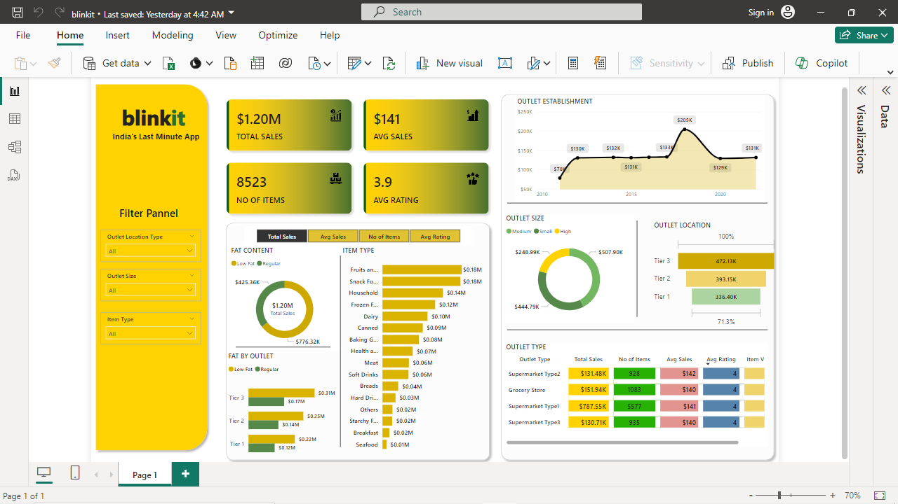

# Blinkit Sales Analysis Dashboard

This project presents a **Blinkit Sales Analysis Dashboard** created using **Power BI**, which provides valuable insights into grocery sales data. The dashboard is built to analyze key sales metrics and visualize various factors impacting sales performance across different outlets.

## Project Overview

The dataset used in this project contains several columns, such as:

- **Item Fat Content**: Fat content of the items.
- **Item Identifier**: Unique ID for each item.
- **Item Type**: Category of the item.
- **Outlet Establishment Year**: Year in which the outlet was established.
- **Outlet Identifier**: Unique ID for each outlet.
- **Outlet Location Type**: Location type of the outlet (e.g., urban, rural).
- **Outlet Size**: Size of the outlet (small, medium, large).
- **Outlet Type**: Type of outlet (e.g., grocery store, supermarket).
- **Item Visibility**: Visibility of the item on shelves.
- **Item Weight**: Weight of the item.
- **Sales**: Sales figures for the item.
- **Rating**: Rating given by customers.

## Key Calculations

In the dashboard, we calculated the following metrics:

- **Total Sales**: The sum of sales for all items.
- **Average Sales**: The mean sales across items.
- **Number of Items**: The total number of unique items sold.
- **Average Rating**: The average customer rating for items.

## Visualizations

The dashboard includes the following visual elements:

- **Item Fat Content** distribution.
- **Fat Content by Outlet** for comparing fat content across different outlets.
- Distribution of **Item Type** to analyze which item categories have the most sales.
- Analysis of **Outlet Establishment Year**, **Outlet Type**, **Outlet Size**, and **Outlet Location Type** to understand how different outlet characteristics impact sales.

## Filter Panel

- Allows users to filter data based on **Outlet Location Type**, **Outlet Size**, and **Item Type** to explore specific aspects of the dataset interactively.

## Dashboard Preview

Below is a preview of the Blinkit Sales Analysis dashboard:

## Conclusion

This Blinkit Sales Analysis Dashboard provides comprehensive insights into grocery sales performance across different outlets, making it easier to identify trends and factors affecting sales. The Power BI dashboard is fully interactive and enables users to explore data through various visualizations and filters.
